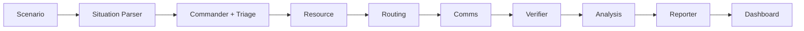

# CrisisSwarm

**Microsoft Build AI Hackathon 2026** · **Theme 05 — Agent Swarms**

**Repository:** [github.com/tejaspatel2255/Mircosoft-crisisswarm](https://github.com/tejaspatel2255/Mircosoft-crisisswarm)

CrisisSwarm is a multi-agent disaster response system. Specialized agents share one **situation brief**, pass structured JSON downstream, and a **Verifier** double-checks the plan before the final SitRep is published. Intelligence is powered by **Groq (Llama 3.3 70B)** with offline fallbacks for resilient demos.

## Features

- **Shared situation parsing** — disaster type, zones, blocked routes, hospitals, priorities
- **Seven specialist agents** — Commander, Triage, Resource, Routing, Comms, **Verifier**, Reporter
- **Cross-agent analysis** — risks, priority zones, recommended actions
- **5 built-in scenarios** — Mumbai, Florida, Tokyo, Turkey, Chennai
- **Dynamic Auto-Zoom Map** — Map automatically adjusts pitch and zoom for the selected scenario
- **Human-in-the-Loop Approval** — Pause the pipeline after routing for operator review before Comms are dispatched
- **PDF Report Export** — Generate styled PDF situation reports with `reportlab`
- **Dual Groq API keys** — automatic rotation on rate limits (`GROQ_API_KEY` + `GROQ_API_KEY_2`)
- **pydeck map** — color-coded triage zones and route ETAs for all 5 scenarios
- **Azure Maps routing** — live route API when `AZURE_MAPS_KEY` is set; haversine fallback otherwise
- **Agent execution trace** — per-step model, latency (ms), Groq key used, Groq vs offline mode
- **Streamlit dashboard** — Operations, Map View, and Agent Trace tabs
- **Docker-ready** — `docker-compose up` for judges and teammates

## Architecture

Agents run **sequentially** with a shared `SwarmContext`. Each step calls Groq when keys are valid; deterministic fallbacks apply on failure.



### How agents collaborate

1. **Situation** reads the raw alert and builds a structured brief (zones, blocked roads, severity).
2. **Triage** classifies casualties per zone (Critical / Serious / Minor) using that brief.
3. **Commander** turns triage into prioritized task assignments.
4. **Resource** allocates ambulances, teams, and shelters.
5. **Routing** computes ETAs (Azure Maps if configured, else haversine) and deployment order.
6. **Comms** drafts responder, hospital, and public alerts.
7. **Verifier** reviews all outputs — flags issues, suggests corrections, approves or blocks.
8. **Analysis** synthesizes the full operation; **Reporter** publishes the executive SitRep.

## Agent roles

| Agent | Role |
|-------|------|
| **Situation** | Structured parse of the alert |
| **Triage** | Per-zone casualties + severity breakdown |
| **Commander** | Task assignments and zone priority |
| **Resource** | Ambulances, medical teams, shelters |
| **Routing** | Azure Maps or haversine ETAs + LLM adjustments |
| **Comms** | Multi-audience alerts |
| **Verifier** | Consistency check, approval, confidence score |
| **Analysis** | Operational synthesis |
| **Reporter** | Executive situation report |

## Tech stack

| Tool | Use |
|------|-----|
| [Groq API](https://console.groq.com/) | Llama 3.3 70B for all agent reasoning |
| [OpenAI Python SDK](https://github.com/openai/openai-python) | Groq-compatible chat client |
| [Streamlit](https://streamlit.io/) | Operations dashboard (3 tabs) |
| [pydeck](https://deckgl.readthedocs.io/) | Interactive zone map with triage colors |
| [Azure Maps Route API](https://learn.microsoft.com/azure/azure-maps/) | Live driving routes when key is set |
| [Docker](https://www.docker.com/) | Containerized demo |

## Project structure

```
crisisswarm/
├── agents/
│   ├── commander.py
│   ├── triage.py
│   ├── resource.py
│   ├── routing.py      # All 5 scenarios + Azure Maps + haversine
│   ├── comms.py
│   ├── verifier.py
│   └── reporter.py
├── core/
│   ├── swarm.py        # Pipeline orchestrator
│   ├── groq_client.py  # Dual-key rotation + quota handling
│   ├── situation.py
│   ├── context.py
│   ├── analysis.py
│   ├── agent_llm.py
│   └── scenario.py     # 5 built-in scenarios + coord detection
├── dashboard/
│   └── app.py          # Operations · Map · Agent Trace
├── config.py
├── docker-compose.yml
├── Dockerfile
├── requirements.txt
└── .env.example
```

## Quick start (local)

### Prerequisites

- Python 3.11+ (3.13 supported)
- [Groq API key](https://console.groq.com/keys)
- Optional: second Groq key from a **different account** for fallback quota
- Optional: [Azure Maps key](https://azure.microsoft.com/products/azure-maps)

### 1. Clone and install

```bash
git clone https://github.com/tejaspatel2255/Mircosoft-crisisswarm.git
cd Mircosoft-crisisswarm
python -m venv .venv

# Windows
.venv\Scripts\activate
# macOS / Linux
source .venv/bin/activate

pip install -r requirements.txt
```

### 2. Configure environment

```bash
cp .env.example .env
```

Edit `.env`:

```env
GROQ_API_KEY=your_groq_api_key_here
GROQ_API_KEY_2=your_second_groq_api_key_here   # optional; use a different Groq account
GROQ_MODEL=llama-3.3-70b-versatile
GROQ_MAX_TOKENS=1024
AZURE_MAPS_KEY=your_azure_maps_key_here        # optional
```

> **Never commit `.env` or real API keys.** Only `.env.example` belongs in git.

### 3. Verify Groq

```bash
python -c "from core.groq_client import verify_connection; print(verify_connection())"
```

### 4. Run

```bash
streamlit run dashboard/app.py
```

Open [http://localhost:8501](http://localhost:8501):

1. Pick any of the **5 scenario buttons** (or type a custom alert)
2. Click **ACTIVATE SWARM**
3. Review **Operations**, **Map View**, and **Agent Trace** tabs

**CLI smoke test:**

```bash
python test_run_swarm.py
```

## Docker

```bash
cp .env.example .env
# Add GROQ_API_KEY to .env

docker-compose up --build
```

UI: [http://localhost:8501](http://localhost:8501)

## Environment variables

| Variable | Required | Description |
|----------|----------|-------------|
| `GROQ_API_KEY` | Yes (for AI) | Primary Groq API secret |
| `GROQ_API_KEY_2` | No | Fallback key; best from a **separate** Groq account |
| `GROQ_MODEL` | No | Default: `llama-3.3-70b-versatile` |
| `GROQ_MAX_TOKENS` | No | Max tokens per agent JSON call (default: `1024`) |
| `AZURE_MAPS_KEY` | No | Enables Azure Maps Route API in Routing agent |
| `STREAMLIT_PORT` | No | Default: `8501` |

## Dual Groq keys

- Keys rotate automatically on rate limits (429) and auth errors.
- Two keys on the **same** Groq account share one daily token limit — use a second account for real extra quota.
- The Agent Trace shows which key (`Key 1` / `Key 2`) handled each step.

## Security before pushing to GitHub

```bash
git status
```

Confirm these are **NOT** listed:

- `.env`
- Any file containing `gsk_` API keys
- `.streamlit/secrets.toml`

Safe to commit:

- Source code
- `.env.example` (placeholders only)
- `README.md`, `requirements.txt`, `Dockerfile`

If you ever committed a key by mistake, **revoke it** at [console.groq.com/keys](https://console.groq.com/keys) and rotate immediately.

## Push to GitHub

```bash
git add .
git status   # confirm .env is NOT listed
git commit -m "feat: dual Groq keys, 5-scenario routing, verifier, agent trace"
git push origin main
```

## Demo video

🎬 **Demo video:** _[Add YouTube / Drive link here before submission]_

Suggested flow (2–3 min):

1. Show **Groq live** banner and **Agent Trace** tab
2. Run **Turkey Earthquake** → show varied route ETAs and Verifier review
3. Switch to **Map View** — colored zones + distances
4. Run **Mumbai Earthquake** — same pipeline, different geography
5. Highlight **Verifier** approval/confidence and dual-key rotation in trace
6. Show Groq console API usage increasing

## Team

- **Tejas** — AI architecture, agent pipeline, Groq integration

## License

MIT (add `LICENSE` file if required by the hackathon).

---

Built for emergency dispatch where **specialization**, **verification**, and **structured coordination** beat a single monolithic LLM reply.
