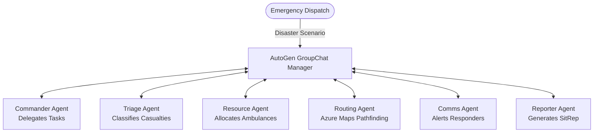

# CrisisSwarm
**Microsoft Build AI Hackathon 2026 Submission**
**Track:** Theme 05 - Agent Swarms

CrisisSwarm is a scalable, containerized Multi-Agent Disaster Response System designed to handle chaotic, multi-variable emergency scenarios. A single agent cannot route ambulances, perform medical triage, and notify families simultaneously without hallucinating. CrisisSwarm solves this by orchestrating a specialized swarm of agents that collaborate, self-organize, and double-check each other's work.

## 🧠 Architecture Overview

Our architecture utilizes **Microsoft AutoGen** to create a distributed swarm. Agents communicate via an AutoGen `GroupChat`, orchestrated by a `GroupChatManager` powered by Groq's high-speed Llama 3 models.



## 🛠️ Microsoft AI Stack & Tools Used

- **Microsoft AutoGen:** Orchestrates the multi-agent `GroupChat`, allowing agents to converse and solve the problem collaboratively.
- **Groq API (Llama 3):** Powers the core intelligence, reasoning, and natural language generation of all agents at blazing speeds.
- **Azure Maps:** Integrated into the Routing Agent to calculate safe, unblocked paths for emergency vehicles.
- **GitHub Copilot:** Used extensively during development to accelerate boilerplate generation and debug AutoGen chat loops.

## 🚀 Setup & Execution (Containerized)

CrisisSwarm is fully containerized as per Theme 5 requirements.

1. **Clone the repository:**
   ```bash
   git clone https://github.com/yourusername/crisisswarm.git
   cd crisisswarm
   ```

2. **Configure Environment:**
   Create a `.env` file from the example:
   ```bash
   cp .env.example .env
   ```
   Add your API credentials:
   ```env
   GROQ_API_KEY=your-groq-api-key
   GROQ_MODEL=llama3-70b-8192
   ```

3. **Launch the Swarm:**
   ```bash
   docker-compose up --build
   ```

4. **Interact:**
   Open the live UI at `http://localhost:8501`.

## 👥 Team Members

- **Tejas** - AI Architect & Backend Engineer (AutoGen & Azure integration)
- *[Add Team Member 2]* - Frontend Developer (Streamlit UI)
- *[Add Team Member 3]* - Domain Expert (Disaster Response Logic)

## 📦 Dependencies
Core libraries: `pyautogen`, `azure-ai-projects`, `azure-maps-route`, `streamlit`, `openai`. (See `requirements.txt` for details).
